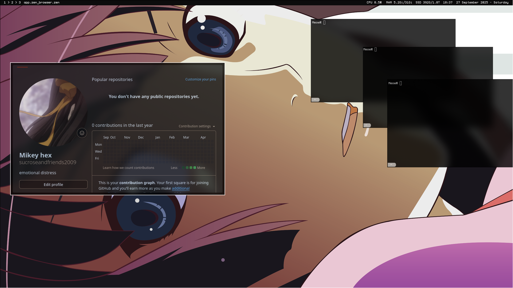

# myminimaldots
My first rice [Hyprland] 

restarting so im just uploading for archive sakes if i want to come and look back at old me

Im new to arch so its mostly jumbled code with a hint of chatgpt, i will be redoing my rice and ill be learning how to do it properly :)

only essentials added : hyprconf,wayb..,wofi../ things like terminal and oter configs arent added because i dont see them as "complete" and are kind of annoying for me so i wont upload them 
